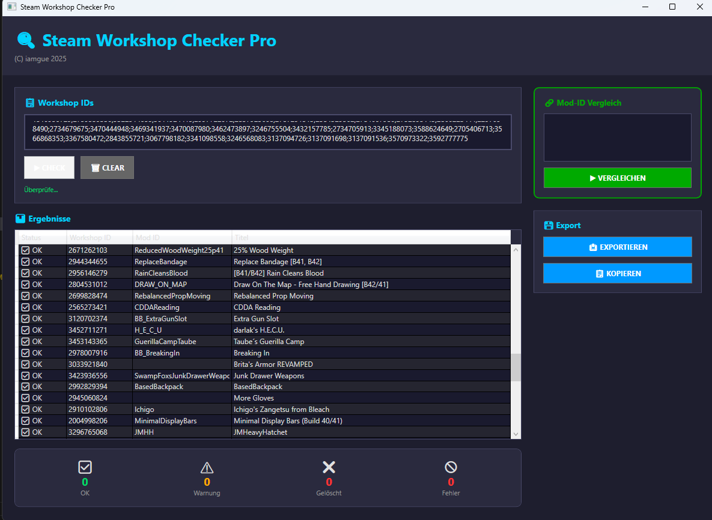

# Steam Workshop Item Checker für Zomboid

Ein modernes Tool zum Prüfen und Verwalten von Steam Workshop Items. Verfügbar in **C#**, **Python** und **Go**.

## 📁 Projektstruktur

```
SteamChecker/
├── csharp/                    # C# Versionen
│   ├── cli/                   # Kommandozeilen-Tool (.NET 9)
│   └── wpf/                   # WPF GUI (Windows Desktop)
├── python/                    # Python Versionen
│   ├── steam_checker_cli.py   # CLI Entry Point
│   ├── run_gui_qml.py         # QML GUI Launcher
│   ├── run_gui_qt.py          # Qt Widgets GUI Launcher
│   ├── run_gui_tk.py          # Tkinter GUI Launcher
│   ├── steam_checker/         # Python Package
│   │   ├── core.py            # Kernlogik
│   │   ├── gui_qml.py         # QML GUI
│   │   ├── gui_qt.py          # Qt Widgets GUI
│   │   ├── gui_tk.py          # Tkinter GUI
│   │   ├── qml/               # QML Dateien
│   │   └── assets/            # GIFs etc.
│   └── requirements.txt
├── go/                        # Go Version
├── releases/                  # Fertige ZIP-Dateien
└── README.md
```

## Für alle, die „einfach nur prüfen" wollen

Dieses Tool hilft dir, fehlerhafte oder gelöschte Workshop-Mods für deinen Zomboid-Server schnell zu finden – ohne Technik-Wissen.

- Erkennt gelöschte/privat gestellte Items und Mods ohne Titel
- Liest die Mod-ID automatisch aus und warnt bei möglichen Problemen (z. B. „Outdated")
- Zeigt dir eine bereinigte Liste an, mit der du deine Server-Config leicht aktualisieren kannst
- Keine Installation nötig (fertige ZIP herunterladen, entpacken, starten)
- Kein Steam-Login erforderlich

## 📦 Downloads

Fertige Release-ZIPs findest du im Ordner `releases/` oder unter:
https://github.com/iamrealguexoxo/SteamChecker/releases/latest

| Release | Beschreibung |
|---------|--------------|
| `SteamChecker-Python-v1.1.zip` | Python GUI & CLI (empfohlen) |
| `SteamChecker-WPF-v1.1.zip` | Windows WPF GUI |
| `SteamChecker-CSharp-CLI-v1.1.zip` | C# Kommandozeile |
| `SteamChecker-Go-v1.1.zip` | Go Version |

**English version below — Deutsche Version zuerst.**

---

## ✨ Neueste Änderungen / Latest changes

<!-- CHANGELOG:START -->
## 1.1.0 — 2025-11-28

### Added
- **Python GUI & CLI**: Complete Python port with three GUI variants (Tkinter, Qt Widgets, QML)
- **QML Material GUI**: Modern Qt Quick Controls 2 interface with Material theme
- **Multi-Mod-ID Support**: Extracts multiple Mod-IDs per Workshop item (spaces, brackets, ampersands)
- **Comparison Badges**: Visual pills showing OK/Gemischt/Zusätzlich after Mod-ID comparison
- **Filter Controls**: Collapsible filter panel for Status, Warning, and Compare tags
- **Clickable Rows**: Workshop-IDs and titles open browser; right-click for context menu
- **Autoscroll**: List auto-scrolls during checking to show latest results
- **Dark/Light Theme Toggle**: Quick switch between themes in all GUIs
- **Cancel Button**: Abort running checks cleanly
- **About Dialog**: With optional animated GIF support

### Changed
- **Project Structure**: Reorganized into `csharp/`, `python/`, `go/`, `releases/` folders
- **Noise Word Filter**: Excludes common words (is, are, the, my, etc.) from Mod-ID extraction
- **HTML Entity Decoding**: Properly handles `&amp;` and other entities in titles

### Fixed
- Mod-ID parsing for items with spaces (e.g., "Planet Terror Katana")
- Mod-ID parsing for special characters (apostrophes, brackets)
- Detection of deleted items showing "Project Zomboid :: Steam Community" title
<!-- CHANGELOG:END -->

---

## 🖼️ WPF Graphical Interface



Die **WPF-GUI** bietet eine benutzerfreundliche grafische Oberfläche mit:
- 📝 Intuitive Input-Felder für Workshop-IDs
- ✅ Live-Ergebnisse in übersichtlicher Tabelle
- 🔗 Mod-ID Vergleich mit deiner Config
- 📊 Statistik-Übersicht (OK, Warnungen, Gelöscht, Fehler)
- 💾 Export- und Kopier-Funktionen
- 🎨 Dunkles Design mit farbigen Highlights
- ℹ️ About-Dialog mit animiertem Logo und dynamischer Versionsanzeige

**Start der WPF-App:**
```powershell
cd .\csharp\wpf
dotnet build
dotnet run
```

---

## 🐍 Python GUI & CLI

Für alle, die das Tool lieber in Python nutzen möchten, gibt es eine vollständige Python-Implementierung mit drei Oberflächen (Tkinter, Qt Widgets und QML) plus CLI.

### Kernfunktionen (gelten für alle Python-Frontends)
- 🔄 **Streaming-Prüfung**: Fortschritt, Status-Text und Zusammenfassung aktualisieren sich live.
- 🆔 **Multi-Mod-ID-Erkennung**: Unterstützt mehrere IDs pro Workshop-Eintrag (auch mit Leerzeichen, Klammern oder `&`).
- ⚠️ **Warnungslogik**: Kennzeichnet automatisch "Outdated"-Titel oder reine B42-Mods.
- 🧹 **Warnungs-Mods entfernen**: Ein Klick erzeugt eine bereinigte ID-Liste ohne riskante Mods.
- 🔍 **Mod-ID-Vergleich**: Liefert "VORHANDEN / FEHLT / ZUSÄTZLICH" und markiert Einträge direkt in der Tabelle.
- 📋 **Kontext-Aktionen**: Alle GUIs bieten Copy-Funktionen für Links, IDs und die bereinigte Liste.
- 🌐 **Keine Anmeldung nötig**: Es wird nur die öffentliche Workshop-Seite abgefragt.

### Schnellstart Python (empfohlen: QML GUI)

```powershell
cd .\python
# Python 3.13 empfohlen (PySide6 benötigt Python < 3.14)
pip install -r requirements.txt
python run_gui_qml.py
```

### Alternative GUIs

```powershell
# Qt Widgets GUI
python run_gui_qt.py

# Tkinter GUI (keine PySide6 erforderlich)
python run_gui_tk.py

# CLI
python steam_checker_cli.py
```

### QML Material GUI – Highlights
- 📋 **Filterbar**: Drei Live-Filter für Status, Warnung und Vergleichs-Tag (OK / Gemischt / Zusätzlich). Der Filterbereich ist einklappbar.
- 🏷️ **Vergleichs-Badges**: Jeder Eintrag erhält einen farbigen Pillen-Status (OK, Gemischt oder Zusätzlich), sobald ein Mod-ID-Vergleich durchgeführt wurde.
- 🔗 **Klickbare Felder**: Workshop-ID und Titel öffnen direkt den Browser; Rechtsklick bietet "Link kopieren" oder "ID kopieren".
- 📜 **Autoscroll**: Während des Prüfens scrollt die Liste automatisch nach unten, damit die neuesten Resultate sichtbar bleiben.
- 🎨 **Material Dark/Light**: Schneller Theme-Wechsel, abgestimmte Farben und dezente Zeilenhintergründe.
- 🧰 **Kontextdialoge**: Vergleichsergebnis und About-Dialog (mit optionalem `bart.gif`) erscheinen als moderne Popups.

---

## 🇩🇪 Deutsch – C# CLI (Kommandozeile)

Ein kleines CLI-Tool zum Prüfen von Steam Workshop Items anhand ihrer IDs.

### Features
- Prüfung beliebiger Workshop-IDs (eingeben mit `;` getrennt)
- Ermittelt Titel; erkennt „gelöscht", „kein Titel" (z. B. privat) und Fehler
- Extrahiert die Mod-ID aus der Workshop-Seite und zeigt sie an
- Warnungen bei "Outdated" oder "B42-only" Mods
- Interaktive Abfrage, ob Mods mit Warnungen aus der Liste entfernt werden sollen
- Optionaler Abgleich deiner eigenen Mod-IDs mit den gefundenen Mod-IDs

### Schnellstart
```powershell
cd .\csharp\cli
dotnet build
dotnet run
```

---

## 🇬🇧 English – CLI

A small CLI tool to check Steam Workshop items by their IDs. It reads the title and extracts the Mod ID, detects deleted/private entries and warnings.

### Features
- Validate any number of Workshop IDs (semicolon-separated input)
- Reads the item title; detects "deleted", "no title" (e.g., private), and errors
- Extracts the Mod ID from the page and displays it
- Warnings for "Outdated" or "B42-only" mods
- Interactive prompt to remove mods with warnings from your list
- Optional comparison of your own config Mod IDs with the found Workshop Mod IDs

### Quick start
```powershell
cd .\csharp\cli
dotnet build
dotnet run
```

---

## 🤝 Contributions

Issues and pull requests are welcome. If you have improvements, new patterns for detection, or UI enhancements, feel free to contribute!

---

## 📄 License

MIT License

Copyright (c) 2025 iamrealguexoxo

---

## 🔗 Links

- **GitHub**: [iamrealguexoxo/SteamChecker](https://github.com/iamrealguexoxo/SteamChecker)
- **Author**: iamrealguexoxo
- **Last Updated**: November 2025
